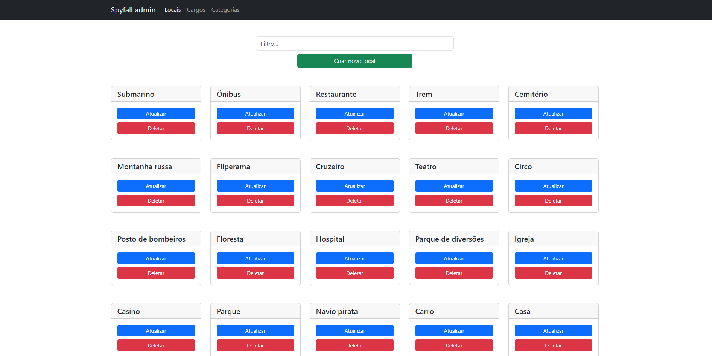

# Spyfall

Este repositório contém o código base do jogo multiplayer de tabuleiro [spyfall](https://www.spyfall.app/).

As principais tecnologias usadas no projeto foram: [React](https://react.dev/), [TypeScript](https://www.typescriptlang.org/), [Socket.io](https://socket.io/), [Bootstrap](https://getbootstrap.com/) e [Express](https://expressjs.com/pt-br/).

## Sobre o jogo

### Tutorial em vídeo

Caso prefira, existe [um tutorial em vídeo muito bom no YouTube, feito pelo canal Covil dos Jogos](https://youtu.be/OdbCMcpCR4c?si=jx8pOGtwF-S0b2Zg)

### Contexto

Você é um detetive e está em uma festa com outras pessoas. Porém, um dos presentes é um espião que não sabe onde está.

### Recomendações para jogatina

- 3 a 8 pessoas

- Todos podendo se comunicar um com os outros, sendo presencialmente ou não

- Um dispositivo para cada jogador

### Como jogar

Será sorteado uma pessoa para ser o **espião** e todos outros serão os **detetives (não espiões)**. Também será sorteado um **lugar** para onde todos estão indo. O espião não sabe onde está, mas os detetives sim. Os objetivos de cada um são:

- **Espião**: descobrir onde está, acabar com o tempo e não ser descoberto ou fazer com que outro detetive seja acusado como espião

- **Detetives**: descobrir quem é o espião

### Rodadas

No início de cada rodada, todos os jogadores, exceto o espião, recebem uma **profissão** e um **lugar**. A profissão é o que o jogador faz no lugar sorteado, podendo ser usada para fazer "atuações" daquela profissão. A atuação pela profissão é opcional, mas sempre serão sorteadas. No começo da rodada, um jogador será escolhido como questionador, tendo que escolher um dos outros jogadores para fazer **uma pergunta** a respeito do lugar. O perguntado deve responder a pergunta, buscando não dar muitos detalhes (para não dar muita informação para o espião), mas o suficiente para remover suspeitas dos outros detetives. O espião, quando perguntando ou perguntar, deve blefar, podendo soar suspeito. Existem três formas de acabar a rodada:

**Votação unanime**: a qualquer momento na partida, um jogador pode acusar outro jogador, abrindo uma votação. Para a votação ser aprovada, todos os jogadores devem concordar com ela. Caso pelo menos um dos jogadores recuse a votação, ela será encerrada e a rodada continuará normalmente. O acusado não tem poder de voto em sua acusação. Caso a votação seja aceita e o espião tenha sido o acusado, todos os detetives ganham pontos, sendo que o acusador ganha pontos extras. Caso o acusado seja um detetive, o espião ganha.
  
**Adivinhação do local**: a qualquer momento da partida o espião pode tentar adivinhar o local. Se o espião adivinhar o local corretamente, ele ganha, caso contrário, todos os detetives ganham.

**Tempo acabou**: no começo da rodada, um cronômetro será iniciado. Caso o tempo acabe, o espião ganha

## Prints do jogo

Página de edição de locais (interface para configuração de banco de dados):

Página do lobby:

Página de configurações:

Página do jogo:

(Sim, eu que desenhei essas obras artítiscas das imagens dos locais)

Página de votação/acusação:

Página de resultados:

## Instalação e execução

Existem duas formas de executar o projeto, e cada uma com uma finalidade. Uma forma de execução é o modo produção, para colocar no ar o jogo para que o público possa jogar. A outra forma é desenvolvimento, para conseguir visualizar o resultado das modificações do código ao vivo.

### Como executar - Modo produção

Para subir o servidor, é preciso ter instalado o `Docker` e o `Docker Compose`. O docker disponibiliza um [tutorial para sua instalação](https://docs.docker.com/desktop/).

Com tudo instalado, para colocar o jogo no ar em modo de produção, siga os passos abaixo:

1 - Configurar `.env`

As principais variáveis que devem ser modificadas são:

  - `DB_PATH`: endpoint para fazer requisições ao banco de dados.
  - `ADM_PATH`: endpoint para acessar a página de administração (configurações do banco de dados). Para acessar a página, a URL final será: `<endereço_servidor>/<DB_PATH>`.
  - `GAME_PATH`: endpoint para acessar a página do jogo. Para acessar a página, a URL final será: `<endereço_servidor>/<GAME_PATH>`.
  - `PORT`: porta em que toda a aplicação ficará exposta.
  - `PASSWORD`: senha que será pedida para acessar a página de administração. Essa senha dará acesso total para manipulação do banco de dados, logo, cuide bem dela.

2 - `docker-compose up`

Esse comando irá subir o servidor no ar (esse comando funciona para o Windows, mas pode ser diferente para outro OS). Isso pode levar um tempo considerável, já que irá instalar todas as bibliotecas necessárias. Mas, uma vez feito isso, é esperado que não seja mais tão demorado para executar novamente.

### Como executar - Modo desenvolvimento

Para subir o servidor de banco de dados, é preciso ter instalado o `Docker` e o `Docker Compose`. O docker disponibiliza um [tutorial para sua instalação](https://docs.docker.com/desktop/).

Para instalar as bibliotecas, é neceessário ter o Node.js instalado. Pode ser instalado pelo [próprio site do Node.js](https://nodejs.org/en).

Com tudo instalado, para começar a desenvolver, siga os passos abaixo:

1 - Na pasta `backend`, rodar `docker-compose up`

Este comando irá subir o servidor de banco de dados.

2 - Na mesma pasta, em outro terminal, executar `npm install`

Instalará as bibliotecas necessárias para subir o servidor do backend.

3- Rodar o comando `npm run server`

Irá subir o servidor backend

4 - Escolher o frontend `spyfall-br-adm` ou `spyfall-br-game` e rodar `npm install` e depois `npm run start`.

Isso irá gerar o frontend ao vivo, podendo edita-lo e ver as modificações rapidamente. `spyfall-br-adm` é o frontend da página de administração e `spyfall-br-game` é o frontend da página do jogo.

## Backup

O banco de dados virá "vazio" por padrão, sem nada cadastrado. Existe o arquivo `dumpfile` com um backup, que possui um banco de dados previamente populado que pode ser utilizado como base.

Mas, carregar o backup não é obrigatório, o banco de dados pode ser populado manualmente na página de administração.

### Aplicando backup ao banco de dados

Para aplicar o backup do banco de dados, siga os passos abaixo:

1- Execute o comando: `docker ps`

Esse comando irá mostrar os containers ativos no momento (é preciso que o servidor esteja no ar). É preciso buscar o id do container de nome `spyfall-br_db`.

Por exemplo, um possível retorno desse comando seria:

Nesse print, está marcado o container com nome `spyfall-br_db`. Este tem o id `f83859a807d4`, que deverá ser utilizado nos comandos posteriores.

2- Execute o comando: `docker exec -i <container-id> pg_restore -U postgres -d spyfall --clean --create < dumpfile`

No comando acima, antes de executar, substitua `<container-id>` pelo id descoberto pelo primeeiro comando executado. No caso do exemplo,
`container-id` seria substituido por `f83859a807d4`.

Este comando aplicará o backup no servidor de banco de dados.

OBS: pode ser que esse comando não funcione totalmente ao executar apenas uma vez... Talvez executar duas vezes resolva o problema.

### Criando arquivo de backup

Para criar um novo backup, siga os comandos abaixo:

1- Execute o comando: `docker ps`

Esse comando irá mostrar os containers ativos no momento (é preciso que o servidor esteja no ar). É preciso buscar o id do container de nome `spyfall-br_db` (mesma coisa que o
comando 1 para aplicar o backup).

2- Execute o comando: `docker exec -i <container-id> pg_dump -U postgres -d spyfall -F c --clean --create -f dumpfile`

No comando acima, antes de executar, substitua `<container-id>` pelo id descoberto pelo primeeiro comando executado. No caso do exemplo,
`container-id` seria substituido por `f83859a807d4`.

Esse comando irá criar um novo arquivo `dumpfile` com o backup do banco de dados. CUIDADO: esse comando irá sobrescrever o arquivo `dumpfile`,
então, tome cuidado antes de executar esse comando.
